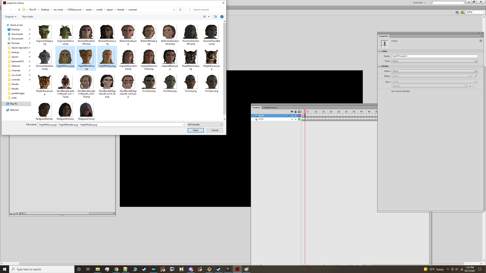
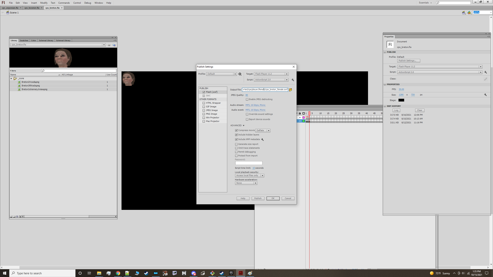

# Icon Pack Tutorial

- [Requirements](#requirements)
- [Organization and Labels](#organization)
- [Importing Image Assets](#importing-assets)
- [Changing Image Compression](#image-compression)
- [Drag to Stage](#add-to-stage)
- [Fill in Frame Label](#fill-in-labels)
- [Validate and Compile](#validation)
- [Generate a Gallery](#gallery)

## Requirements

1. Adobe Flash CS6
2. Python 37+, Pip3 19+(Optional. Used for creating galleries)


## Organization and Labels

1. Icons follow a specific directory structure. Failure to follow this structure can result in icons not loading or being loaded in the wrong category.
The directory structure is as follows starting from the Data/Interface/Exported/cps folder

```shell
├───classes
├───default
├───factions
├───keywords
├───npcs
├───overrides (N/A)
├───player
│   ├───female
│   ├───generic
│   └───male
└───races
```

* classes contain icons for NPC classes(e.g Warrior, Thief, Mage). Please see the class guide on what available labels are allowed and how an npcs class is determined.
* default contains generic icons (e.g. Summon timers, Difficulty indicators, unknown actor icons)
* factions contains NPC faction icons( E.g. Dawnguard, Bandits, Blades)
* keywords contain NPC keyword icons. (E.g ActorTypeGhost, ActorTypeGiant) These support overrides but not extending(You cannot add a keyword thats not present)
* npcs is self explanatory.
* player icons is subdivided into 3 folders. Female icons only appear for when the PC is female. Male appears when the PC is male. Generic appears in both cases.
* races is for an npc's race.

- All icon packs require .ini and .swf files. These file pairs must have matching names or they will be ignored.
- Labels in the ini must match the frame labels in the swf (order does not matter.) Any mistakes will result in icons continously looping or showing up blank.
- The recommended size is 75x75 so as to cut down on vram usage.

## Importing Image Assets

1. Grab the cps_icons_template.fla file from the resources directory. This file comes with frames and labels set up so that users only have to drag/drop images and fill in frame names.
2. Preprep the icons you want to use and download/store them in one folder. At this point, your icons should already be resized hopefully to 75 x 75. I recommend naming them the same as their frame label.
3. Open the template file in CS6.
4. Under File->Import, select Import to Library. Select all the images that you wish to use and hit ok.



## Changing Image Compression(Skip if using svg)

5. In your library tab select all the images that you imported and click on properties.
6. Set compression to png and enable smoothing. This is a mandatory step as any other compression will not let them load.


7. Save your file.(Rename it to something unique that pertains to what kind of pack it is)

## Fill in Frame Label(s)

8. On the labels layer select an empty frame insert a name for the frame in the properties window. Once you do this you should see a redflag.
- If making a race pack the name should be the editorId of the race.
- If making a npc pack, the name should be the FULL name of the npc. You can get this in game from the console or in xEdit or one of the skyrim wikis.
- If making a faction pack, the name should be the FULL name of the faction in xedit. If the FULL name is empty and it is from one of the vanilla masters, then use the form id instead(e.g 0x1234567)
- If making a player pack, name it something unique. Preferable follow the preexisting naming convention <RaceType>(#) eg. DarkElfSeducer01
- Class/Keyword packs currently do not support adding new unique labels. You must use one of the allowed class labels. Please see the <class guide>/<keyword_guide> on what is allowed.


## Drag to Stage
9. Select the frame on icons layer(in the timeline) under the frame where you added the named label. On this frame drag your icon to the left hand corner(position 0,0)


10. Repeat steps 8 and 9 for all icons you wish to add.(Go to the next empty frame and repeat the process). Make sure that you add these labels to an ini of the same name as your custom swf. I would recommend having all your labels prepared ahead of time.(Making the ini first)

## Validate and Compile
11. Validate your file looks correct. You should have redflags on your labels layer and a black dot for every red flag on the icons label like so:


12. Compile the file. alt shift + f12 and make sure there are no errors. Name your file something unique so as to not override the ones provided here unless you
are making a replacer.

13. Create the ini if you havent done so already. Add a line entry with the name of every frame label you created. The ini should have the same name as your compiled swf.

14. Move the swf and ini to the appropriate directory to test.

Classes go to Data/Interface/Exported/cps/classes
Keywords go to Data/Interface/Exported/cps/keywords
Races go to Data/interface/Exported/cps/races.
Factions go to Data/Interface/Exported/cps/factions.
Npcs go to Data/interface/Exported/cps/npcs
Female players goes to Data/Interface/Exported/cps/player/female
Male players goes to Data/Interface/Exported/cps/player/male
Gender agnostic goes to Data/Interface/Exported/cps/player/generic(gender agnostic), player/male, player/female

15. Test in game. If you have loops or blanks, see the troubleshooting guide on the main page.
If you have questions about anything that needs elaboration or tips on how to improve this guide please post in the comments section of this article.



## Generate a Gallery (Optional)

1. Clone this repository if you have not already done so.
2. In a terminal window(or Powershell, cmdPrompt, GitBash), navigate to the tools/gallery_generator directory. 
3. Assuming you already have python37+ installed, install Pillow. 'pip install Pillow'. (Use pip3 if you're running an older os that comes with py2 installed)
4. Run the tool by pointing it at the directory of your assets like so:
	
Help commands
```shell
python generate_image_gallery.py --help
usage: generate[options]

Generic tool for creating an image gallery

optional arguments:
  -h, --help            show this help message and exit
  --files_path FILES_PATH
                        Path to folder of images to generate gallery for
  --outfile OUTFILE     Path to output image
  --height_out HEIGHT_OUT
                        Height of output image in px
  --width_out WIDTH_OUT
                        Width of output image in px
  --sub_width SUB_WIDTH
                        Width of sub images image in px
  --sub_height SUB_HEIGHT
                        Height of sub image in px
  --width_buffer WIDTH_BUFFER
                        Horizontal spacing between images
  --height_buffer HEIGHT_BUFFER
                        Vertical spacing between images
  --font_size FONT_SIZE
                        Size of font text
  --disable_text        The name of an image will not be written below it
  --strip_pattern STRIP_PATTERN
                        Removes pattern from image names

```

```shell
python generate_image_gallery.py --files_path ../../assets/vanilla/classes/zoomed/ --height_out 1080 --width_out 1920 --sub_width 75 --sub_height 75 --width_buffer 60 --height_buffer 40 --strip_pattern Class --outfile ../../dist/vanilla_class_out.png
Successfully wrote ../../dist/vanilla_class_out.png
```
Thats it! All done. Upload your files and optionally gallery to the nexus and share it with us all :pray:.