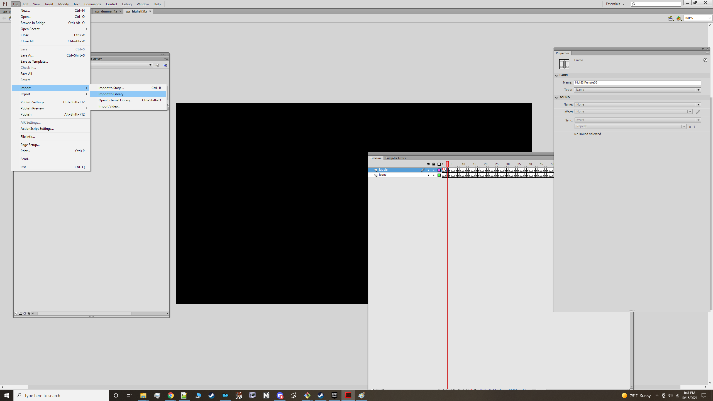
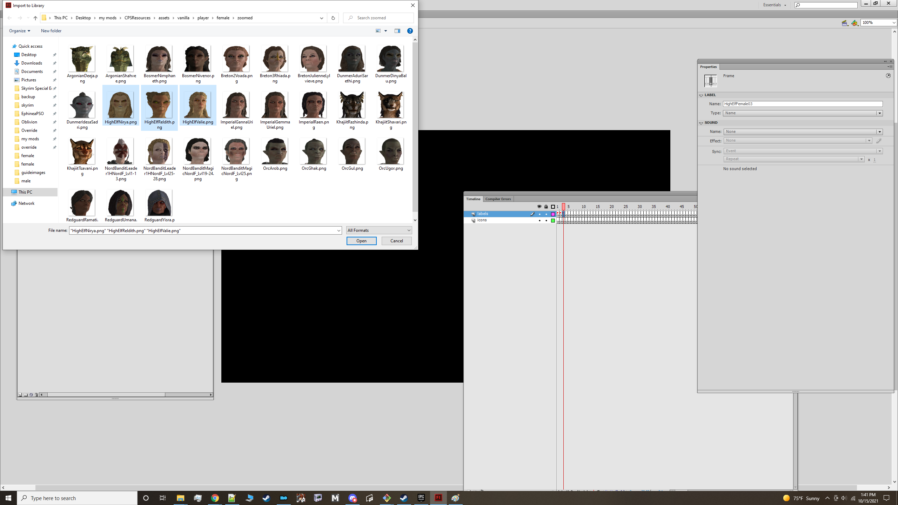
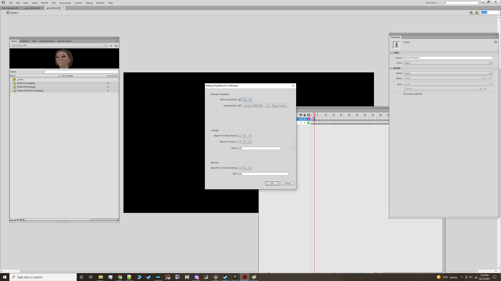
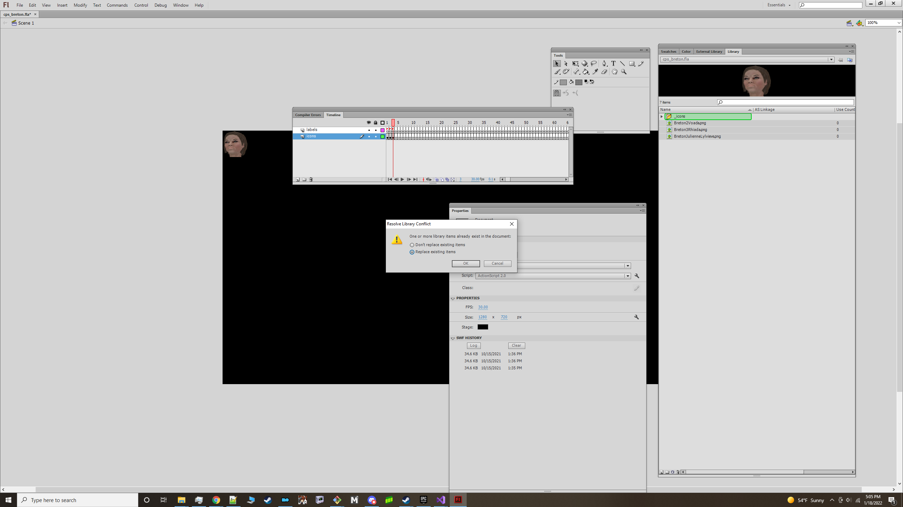
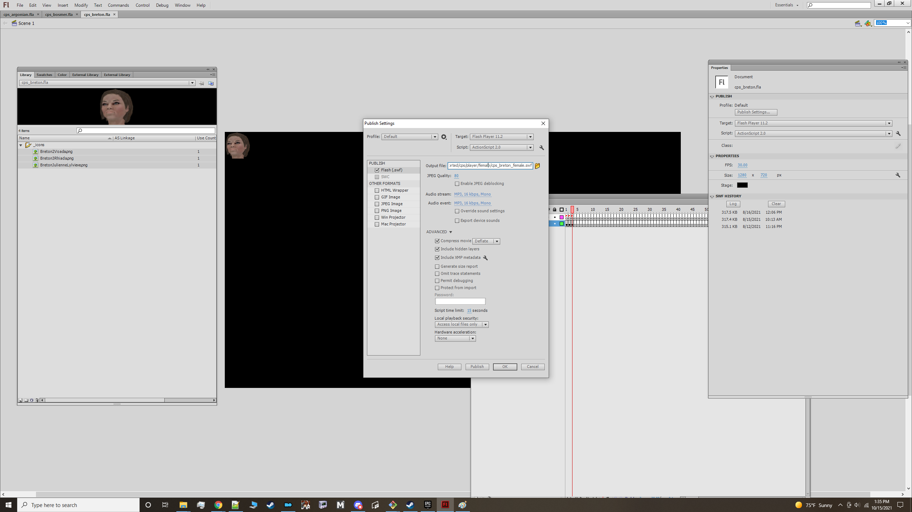

# Quick Replace Tutorial

- [Requirements](#requirements)
- [Prepare Images](#prepare-images)
- [Importing Image Assets](#importing-image-assets)
- [Changing Image Compression](#changing-image-compression)
- [Override Existing Assets](#override-existing-assets)
- [Validate and Compile](#validate-and-compile)
- [Generate a Gallery](#generate-a-gallery)

## Requirements

1. Adobe Flash CS6
2. Python 37+, Pip3 19+(Optional. Used for creating galleries)

## Prepare Images

1. Make sure that all the images you want to override have the same name as their corresponding counterparts in one of the assets/<pack_type>/zoomed folder. E.g If you
want to override ClassFoodVendor in assets/game-icons/ then your new image should also be named ClassFoodVendor. By using the same name we can skip the step of dragging images to the stage
and instead replace their stage counterparts in place with our own.

## Importing Image Assets

1. Grab the resource file from the resources directory that has icons you want to replace.
2. Pre prep the icons you want to use and download/store them in one folder. At this point, your icons should already be resized hopefully to 75 x 75. They must have the same name as the pre-existing file in the assets folder.
This is because one you import and replace them, their instance(s) on the stage will automatically update and point to your replacements.
3. Open the resource file in CS6.
4. Under File->Import, select Import to Library. Select all the images that you wish to use and hit ok.



## Changing Image Compression(Skip if using svg)

5. In your library tab select all the images that you imported and click on properties.
6. Set compression to png and enable smoothing. This is a mandatory step as any other compression will not let them load.


Take notice that there is a folder named "_icons" in the above image. Also take notice of the 'Use Count' column of all the images. They are at 0.

## Override Existing Assets

Select all the assets you've just imported and drag them to the _icons folder. You should get a notice pop up asking if you would like to override existing items like so:



## Validate and Compile
7. Validate your file looks correct. In the _icons folder check the 'Use Count' of the images you imported. In a select few cases, images may not be named as they were in the assets
    folder. If they weren't then you will have to drag them to the stage in the frame of where the image you want to replace is. For more info on this please see the [icon-pack-tutorial](creating-an-icon-pack.md).

8. Compile the file. alt shift + f12 and make sure there are no errors. Name your file something unique so as to not override the ones provided here unless you
are making a replacer.



9. Create the ini if you havent done so already. Add a line entry with the name of every frame label you created. The ini should have the same name as your compiled swf.

10. Move the swf and ini to the appropriate directory to test.

- Classes         -> Data/Interface/Exported/cps/classes
- Keywords        -> Data/Interface/Exported/cps/keywords
- Races           -> Data/interface/Exported/cps/races.
- Factions        -> Data/Interface/Exported/cps/factions.
- Npcs            -> Data/interface/Exported/cps/npcs
- Female player   -> Data/Interface/Exported/cps/player/female
- Male player     -> Data/Interface/Exported/cps/player/male
- Gender agnostic -> Data/Interface/Exported/cps/player/generic

11. Test in game. If you have loops or blanks, see the troubleshooting guide on the main page.
If you have questions about anything that needs elaboration or tips on how to improve this guide please post in the comments section of this article.

## Generate a Gallery (Optional)

1. Clone this repository if you have not already done so.
2. In a terminal window(or Powershell, cmdPrompt, GitBash), navigate to the tools/gallery_generator directory. 
3. Assuming you already have python37+ installed, install Pillow. 'pip install Pillow'. (Use pip3 if you're running an older os that comes with py2 installed)
4. Run the tool by pointing it at the directory of your assets like so:
	
Help commands
```shell
python generate_image_gallery.py --help
usage: generate[options]

Generic tool for creating an image gallery

optional arguments:
  -h, --help            show this help message and exit
  --files_path FILES_PATH
                        Path to folder of images to generate gallery for
  --outfile OUTFILE     Path to output image
  --height_out HEIGHT_OUT
                        Height of output image in px
  --width_out WIDTH_OUT
                        Width of output image in px
  --sub_width SUB_WIDTH
                        Width of sub images image in px
  --sub_height SUB_HEIGHT
                        Height of sub image in px
  --width_buffer WIDTH_BUFFER
                        Horizontal spacing between images
  --height_buffer HEIGHT_BUFFER
                        Vertical spacing between images
  --font_size FONT_SIZE
                        Size of font text
  --disable_text        The name of an image will not be written below it
  --strip_pattern STRIP_PATTERN
                        Removes pattern from image names

```

```shell
python generate_image_gallery.py --files_path <MY_PATH>--height_out 1080 --width_out 1920 --sub_width 75 --sub_height 75 --width_buffer 60 --height_buffer 40 --strip_pattern Class --outfile <MY_GALLERY>
Successfully wrote ../../dist/vanilla_class_out.png
```
Substitute MY_PATH and MY_GALLERY for the path to the directory of your images and the output of the file. 
Thats it! All done. Upload your files and optionally gallery to the nexus and share it with us all :pray:.
